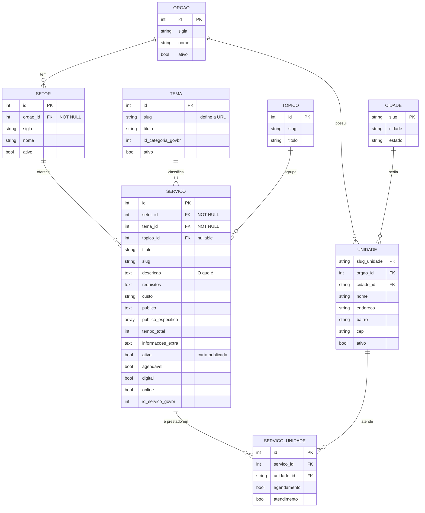

# Carta de Serviço — Estrutura, MER e DER

> **Para:** Analista de Negócio e Líder Técnico
> **Objetivo:** mostrar **quantas cartas de serviço existem** e **como elas estão estruturadas no banco**.
> **Fonte:** banco `admin_prd` (PostgreSQL), extração em **28/07/2026**.
> **Planilha anexa:** [`cartas-servico-ativas.xlsx`](cartas-servico-ativas.xlsx) — as 1.227 cartas ativas, carta a carta.

---

## 1. Quantas cartas temos

| Indicador | Valor |
|---|---:|
| **Cartas de serviço ativas** | **1.227** |
| Serviços cadastrados (inclui inativos) | 1.522 |
| Inativos / não publicados | 295 |
| Órgãos com carta publicada | 40 |
| Setores | 314 ¹ |
| Categorias (temas) | 21 |
| Vínculos serviço ↔ unidade de atendimento | 15.724 |

¹ São 314 setores distintos, mas apenas **290 nomes distintos** — o mesmo nome de setor
se repete em órgãos diferentes ("Ouvidoria", "Unidade Setorial/Seccional de Controle
Interno"). Ao agrupar a planilha, **agrupe por órgão + setor**, nunca só por setor.

**Modalidade de prestação** (uma carta pode ter mais de uma):

| Modalidade | Cartas |
|---|---:|
| Digital | 279 |
| Online | 148 |
| Agendável | 118 |

**Integração gov.br:** 1.202 das 1.227 cartas (98%) têm `id_servico_govbr` preenchido.

### Concentração por órgão (top 10)

| Órgão | Cartas |
|---|---:|
| SEFAZ MS | 277 |
| UEMS | 125 |
| IAGRO | 119 |
| DETRAN | 65 |
| SANESUL | 48 |
| SED MS | 47 |
| AGEPREV | 40 |
| SES | 37 |
| IMASUL | 34 |
| SEGOV MS | 29 |

> Os 10 maiores concentram 821 das 1.227 cartas (67%). Só SEFAZ MS responde por 23%.

### Distribuição por categoria

| Categoria | Cartas | | Categoria | Cartas |
|---|---:|---|---|---:|
| finanças-e-impostos | 228 | | meio-ambiente | 32 |
| educação-e-pesquisa | 166 | | ciência-e-tecnologia | 22 |
| agropecuária-e-vida-rural | 157 | | energia | 14 |
| comunicação-e-transparência | 134 | | assistência-social | 10 |
| empresa-indústria-e-comércio | 111 | | esporte-e-lazer | 8 |
| administração-pública | 96 | | turismo | 7 |
| trânsito-e-transportes | 71 | | habitação | 5 |
| trabalho-emprego-e-previdência | 44 | | arte-e-cultura | 5 |
| saúde-e-cuidado | 39 | | infraestrutura | 4 |
| direitos-e-cidadania | 37 | | forças-armadas-e-defesa-civil | 1 |
| segurança | 36 | | | |

---

## 2. O que é uma carta de serviço

Cada carta é **uma página pública no portal** (`https://www.ms.gov.br/<categoria>/<slug>`)
que descreve um serviço prestado ao cidadão. Ela é composta por blocos fixos:

| Bloco na carta | O que responde |
|---|---|
| **Título** | Qual é o serviço |
| **O que é** | Descrição do serviço |
| **Requisitos** | O que o cidadão precisa apresentar |
| **Custo** | Quanto custa |
| **Público** | A quem se destina (texto livre) |
| **Público específico** | Marcação estruturada: Cidadão, Empresa, Servidor… |
| **Tempo total** | Prazo de atendimento |
| **Informações extras** | Links, orientações complementares |
| **Onde é atendido** | Unidades presenciais vinculadas ao serviço |
| **Quem oferece** | Órgão e setor responsáveis |
| **Categoria** | Tema sob o qual a carta é listada no portal |

Todos esses blocos vêm de **uma linha em `gerenciamento_servicos`** mais os
relacionamentos descritos abaixo. A planilha anexa traz esses blocos já convertidos de
HTML para texto plano.

---

## 3. MER — modelo de entidades e relacionamentos

Três eixos organizam a carta:

### 3.1 Quem oferece
```
Órgão (1) ──< Setor (1) ──< Serviço
```
Um órgão tem vários setores; um setor oferece vários serviços. A carta sempre chega ao
órgão **através do setor** — não há vínculo direto serviço → órgão.

### 3.2 Como é classificado
```
Tema (1) ──< Serviço        Tópico (1) ──< Serviço
```
O **Tema** é a categoria do portal (finanças-e-impostos, saúde-e-cuidado…) e define a URL
da carta. O **Tópico** é um agrupamento secundário, opcional.

### 3.3 Onde é atendido
```
Serviço (N) >──< Unidade      (associativa: ServicoUnidade)
Órgão (1) ──< Unidade (N) >── Cidade (1)
```
Relação **N:N**: o mesmo serviço é prestado em várias unidades, e a mesma unidade atende
vários serviços. A associativa `ServicoUnidade` guarda, por par, se aquele ponto oferece
`agendamento` e/ou `atendimento` presencial.

### 3.4 Regras confirmadas no banco

| Regra | Situação |
|---|---|
| `servicos.setor_id` é **NOT NULL** | 0 cartas sem setor |
| `servicos.tema_id` é **NOT NULL** | 0 cartas sem categoria |
| `servicos.topico_id` é *nullable* | tópico é opcional |
| Carta publicada = `servicos.ativo = true` | 1.227 de 1.522 |
| `unidades` tem PK **textual** (`slug_unidade`) | não é inteiro sequencial |
| `cidades` tem PK **textual** (`slug`) | não é inteiro sequencial |

> **Atenção para o Líder Técnico:** `Unidade` e `Cidade` usam *slug* de texto como chave
> primária, e as FKs que apontam para elas (`servicosunidade.unidade_id`,
> `unidades.cidade_id`) são `varchar`, não inteiros. Qualquer de-para de chaves precisa
> preservar esses slugs.

---

## 4. DER — diagrama de entidades e relacionamentos



**Nomes reais das tabelas:**

| Entidade no DER | Tabela |
|---|---|
| SERVICO | `gerenciamento_servicos` |
| SETOR | `gerenciamento_setor` |
| ORGAO | `gerenciamento_orgaos` |
| TEMA | `gerenciamento_temas` |
| TOPICO | `gerenciamento_topicos` |
| SERVICO_UNIDADE | `gerenciamento_servicosunidade` |
| UNIDADE | `gerenciamento_unidades` |
| CIDADE | `gerenciamento_cidades` |

---

## 5. De-para: bloco da carta → coluna do banco

Esta é a tabela que liga a visão de negócio à estrutura física. O percentual é sobre as
1.227 cartas ativas.

| Bloco da carta | Coluna / caminho no banco | Tipo | Preenchido |
|---|---|---|---:|
| Título | `servicos.titulo` | varchar | 100% |
| URL da carta | `temas.slug` + `servicos.slug` | varchar | 100% |
| O que é | `servicos.descricao` | text (HTML) | 100% |
| Requisitos | `servicos.requisitos` | text (HTML) | 100% |
| Custo | `servicos.custo` | varchar | 100% |
| Público | `servicos.publico` | text | 100% |
| Público específico | `servicos.publico_especifico` | array | 100% |
| Tempo total | `servicos.tempo_total` | smallint | 88% ¹ |
| Informações extras | `servicos.informacoes_extra` | text (HTML) | 92% ² |
| Quem oferece — setor | `servicos.setor_id` → `setor.nome` | FK | 100% |
| Quem oferece — órgão | `setor.orgao_id` → `orgaos.sigla` | FK | 100% |
| Categoria | `servicos.tema_id` → `temas.slug` | FK | 100% |
| Agrupamento | `servicos.topico_id` → `topicos.titulo` | FK (opcional) | — |
| Onde é atendido | `servicosunidade` → `unidades` | N:N | 15.724 vínculos |
| Agendável / Digital / Online | `servicos.agendavel` / `.digital` / `.online` | boolean | 118 / 279 / 148 |
| Código gov.br | `servicos.id_servico_govbr` | integer | 98% |

¹ 1.085 cartas com `tempo_total > 0`; as outras 142 estão gravadas como `0`, não como nulo — **`0` aqui significa "não informado", não "atendimento imediato"**.
² 1.126 cartas com texto após limpar o HTML; 101 vazias.

> **Ponto de atenção de conteúdo:** os campos `descricao`, `requisitos` e
> `informacoes_extra` são **HTML cru** no banco (`<p>`, `&eacute;`, links embutidos). Qualquer
> consumo fora do portal precisa tratar isso — a planilha anexa já entrega em texto plano.

---

## 6. Planilha anexa

[`cartas-servico-ativas.xlsx`](cartas-servico-ativas.xlsx) — aba `cartas_ativas`,
1.227 linhas + cabeçalho, 14 colunas, com filtro e primeira linha congelada.

| # | Coluna | Conteúdo |
|---:|---|---|
| 1 | `orgao_sigla` | Sigla do órgão responsável |
| 2 | `setor` | Setor dentro do órgão |
| 3 | `titulo_servico` | Título da carta |
| 4 | `categoria` | Tema (slug da categoria no portal) |
| 5 | `url` | Endereço público da carta |
| 6 | `o_que_e` | Descrição, em texto plano |
| 7 | `requisitos` | Requisitos, em texto plano |
| 8 | `custo` | Custo ao cidadão |
| 9 | `publico` | Público-alvo (texto livre) |
| 10 | `publico_especifico` | Marcações: Cidadão, Empresa, Servidor… |
| 11 | `tempo_total` | Prazo (`0` = não informado) |
| 12 | `informacoes_extra` | Informações complementares, em texto plano |
| 13 | `agendavel` | sim / não |
| 14 | `digital` | sim / não |

### Como reproduzir

O código de extração vive no repositório
`SETDIG/2026/Projetos/extracao-carta`. Requer VPN / rede interna.

```bash
python scripts/extract_cartas_ativas_completo.py --out <caminho>/cartas-servico-ativas.xlsx
```

- Query: `CARTAS_ATIVAS_ESTRUTURA` em `src/extracao_carta/queries.py`
- Limpeza de HTML: `src/extracao_carta/html_text.py`
- Filtro aplicado: `servicos.ativo = true AND servicos.titulo IS NOT NULL`
